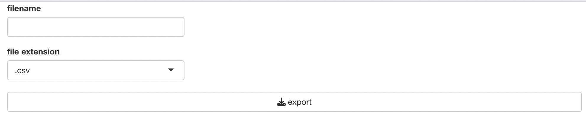
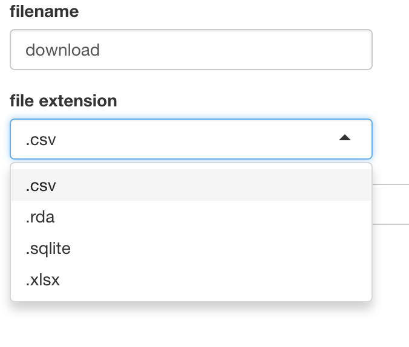

```{r, include = FALSE}
knitr::opts_chunk$set(
  collapse = TRUE,
  comment = "#>"
)
```

## Introduction

`scissor`'s `exportModule` export (download) inputData, which is transformed by other `scissor`'s functions.

In this article, we'll use scholarship dataset of [datatoys](https://github.com/statgarten/datatoys)

This article is based on **0.2.0** Version of scissor

## Declare module

`scissor`'s module assumes that used in the [Shiny](https://shiny.rstudio.com/) application.

and You can use snippet(type `shinyapp`) to build very basic shiny application.

``` r
library(shiny)

ui <- fluidPage(
 
)

server <- function(input, output, session) {
  
}

shinyApp(ui, server)
```

This application will show nothing.

So let's add `exportModule` in **ui**.

``` r
ui <- fluidPage(
  mod_exportModule_ui(
    id = 'module'
  )
)
```

also, `exportModule` in **server**.

``` r
server <- function(input, output, session) {
  mod_exportModule_server(
    id = "module", 
    inputData = reactive(datatoys::scholarship)
  )
}
```

So final (which is very basic) code will like this.

``` r
library(shiny)

ui <- fluidPage(
  mod_exportModule_ui(
    id = 'module'
  )
)

server <- function(input, output, session) {
  mod_exportModule_server(
    id = "module", 
    inputData = reactive(datatoys::scholarship) # remotes::install_github('statgarten/datatoys')
  )  
}

shinyApp(ui, server) # run application
```

You should notice 3 things.

1.  both `id` in **ui** and **server** should be same.
2.  `inputData` in **server** should be format of **reactive**

## Structure of reorderModule



exportModule is consisted with `Control Area`

and below using flow.

1.  Declare module (we did already)
2.  select output format and filename (like '**download**.**csv**')
3.  Export

## Usage of reorderModule

You can select `csv`, `xlsx`, `rda` and `sqlite`.



For any issue or suggestion, please make issue in [scissor's github](https://github.com/statgarten/scissor/issues).
