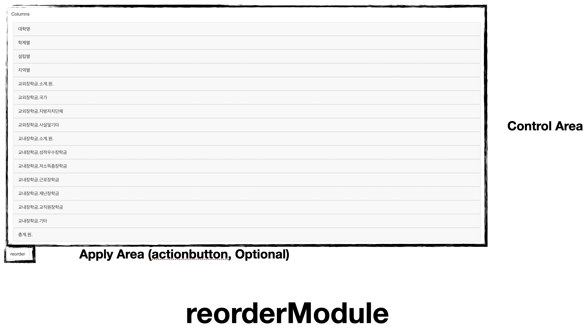
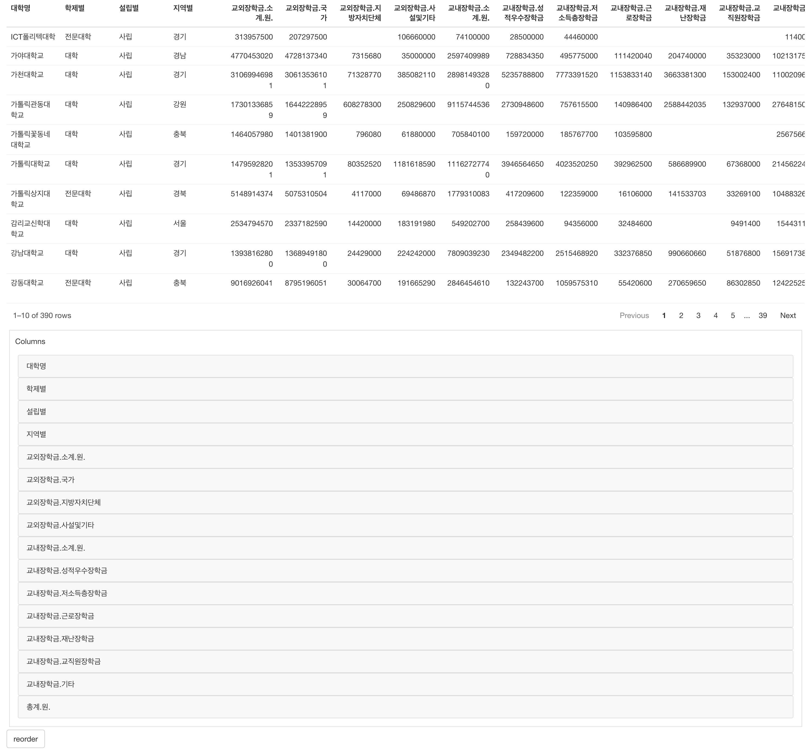
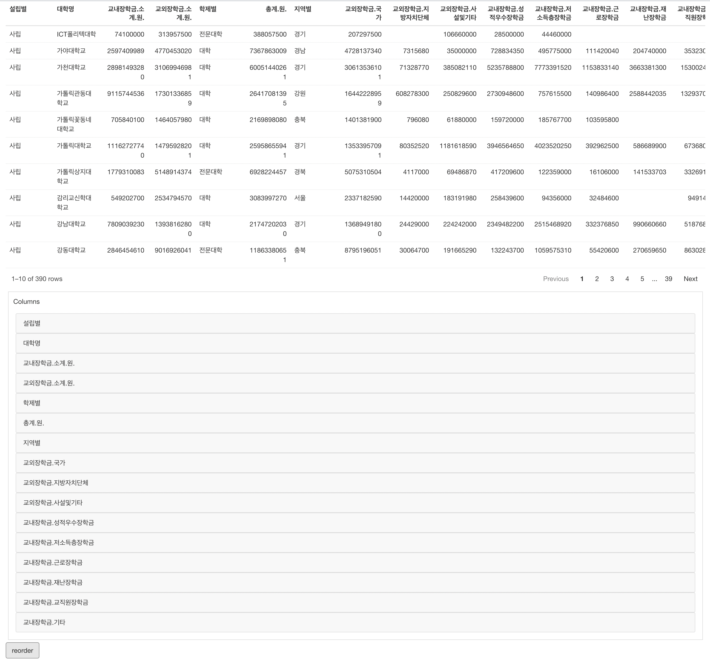

```{r, include = FALSE}
knitr::opts_chunk$set(
  collapse = TRUE,
  comment = "#>"
)
```

## Introduction

`scissor`'s `reorderModule` shows and change order of column using [sortable](https://rstudio.github.io/sortable/)

In this article, we'll use scholarship dataset of [datatoys](https://github.com/statgarten/datatoys)

This article is based on **0.2.0** Version of scissor

## Declare module

`scissor`'s module assumes that used in the [Shiny](https://shiny.rstudio.com/) application.

and You can use snippet(type `shinyapp`) to build very basic shiny application.

``` r
library(shiny)

ui <- fluidPage(
 
)

server <- function(input, output, session) {
  
}

shinyApp(ui, server)
```

This application will show nothing.

So let's add \`reorderModule\`\` in **ui**.

``` r
ui <- fluidPage(
  mod_reorderModule_ui(
    id = 'module'
  )
)
```

also, `reorderModule` in **server**.

``` r
server <- function(input, output, session) {
  mod_reorderModule_server(
    id = "module",
    inputData = reactive(datatoys::scholarship) 
  )
}
```

So final (which is very basic) code will like this.

``` r
library(shiny)

ui <- fluidPage(
  mod_distributionModule_ui(
    id = 'distModule'
  )
)

server <- function(input, output, session) {
  mod_reorderModule_server(
    id = "module",
    inputData = reactive(datatoys::scholarship)  # remotes::install_github('statgarten/datatoys')
  )
}

shinyApp(ui, server) # run application
```

You should notice 3 things.

1.  both `id` in **ui** and **server** should be same.
2.  `inputData` in **server** should be format of **reactive**
3.  Module's reorder will not effect to `inputData` yet

## Structure of reorderModule



reorderModule is consisted with `Control Area`

and below using flow.

1.  Declare module (we did already)
2.  Drag and drop column to reorder
3.  Apply (you should declare additional Action button)

## Usage of reorderModule

Let's add action button and table (to view data) like below.

``` r
library(shiny)

ui <- fluidPage(
  reactable::reactableOutput('table'),
  
  mod_reorderModule_ui(
    id = 'module'
  ),
  actionButton(
    inputId = "applyReorder", 
    label = 'reorder'
  )
)

server <- function(input, output, session) {
  
  # Data link
  inputData <- reactiveVal(NULL)
  inputData(datatoys::scholarship)
  data_rv <- reactiveValues(data = NULL)
  
  observeEvent(inputData(), {
    data_rv$data <- inputData()
  })
  
  # Data View
  output$table <- reactable::renderReactable({
    reactable::reactable(data_rv$data)
  })
  
  
  # Reorder Module
  res_reorder <- mod_reorderModule_server(
    id = "module",
    inputData = reactive(data_rv$data)
  )
  
  # Apply 
  observeEvent(input$applyReorder, {
    data_rv$data <- res_reorder() # reactive
    inputData(data_rv$data) # then use isolated

  })
  
}

shinyApp(ui, server) # run application
```

when you run it you can see image like below.



and if you make change to order of column and apply, you can see result in table.



For any issue or suggestion, please make issue in [scissor's github](https://github.com/statgarten/scissor/issues).
