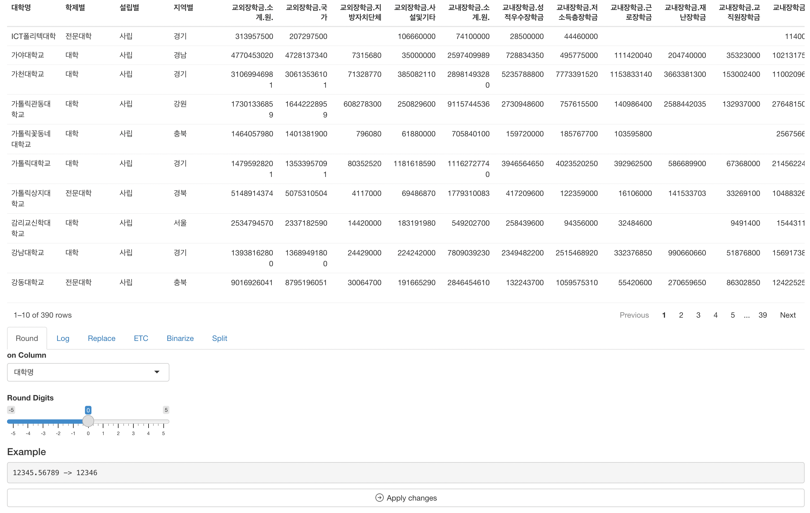
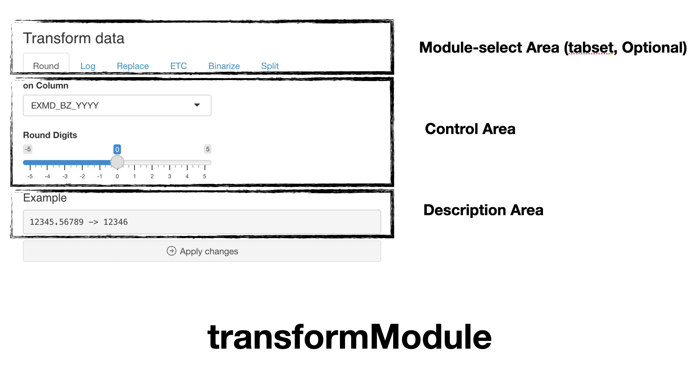

```{r, include = FALSE}
knitr::opts_chunk$set(
  collapse = TRUE,
  comment = "#>"
)
```

## Introduction

There are similar modules to transform data. Below are list of them.

-   Binarize
-   ETC
-   Log
-   Replace
-   Round
-   Split

and in this article, we call them as `transformModule`.

`scissor`'s `transformModule` transforms selected variables.

In this article, we'll use scholarship dataset of
[datatoys](https://github.com/statgarten/datatoys)

This article is based on **0.2.0** Version of scissor.

## Declare module

`scissor`'s module assumes that used in the
[Shiny](https://shiny.rstudio.com/) application.

and You can use snippet(type `shinyapp`) to build very basic shiny
application.

``` r
library(shiny)

ui <- fluidPage(
 
)

server <- function(input, output, session) {
  
}

shinyApp(ui, server)
```

This application will show nothing.

So let's add `binarizeModule` in **ui**

``` r
ui <- fluidPage(
  mod_binarizeModule_ui(
    id = 'binModule'
  )
)
```

also, `binarizeModule` in **server**.

``` r
server <- function(input, output, session) {
  mod_binarizeModule_server(
    id = 'binModule', 
    inputData = reactive(datatoys::scholarship)
  )
}
```

So final (which is very basic) code will like this.

``` r
library(shiny)

ui <- fluidPage(
  mod_binarizeModule_ui(
    id = 'binModule'
  )
)

server <- function(input, output, session) {
  mod_binarizeModule_server(
    id = 'binModule', 
    inputData = reactive(datatoys::scholarship) # remotes::install_github('statgarten/datatoys')
  )
}

shinyApp(ui, server) # run application
```

You should notice 3 things.

1.  Both `id` in **ui** and **server** should be same.
2.  `inputData` in **server** should be format of **reactive**
3.  This exampple may declare module, but it will not work.

## Using multiple modules

As mentioned, there are other modules,

So let's add `ETCModule` to both **ui** and **server**

``` r
ui <- fluidPage(
  mod_binarizeModule_ui(
    id = 'binModule'
  ),
  
  mod_etcModule_ui(
    id = 'etcModule'
  )
)

server <- function(input, output, session) {
  mod_binarizeModule_server(
    id = 'binModule', 
    inputData = reactive(datatoys::scholarship) # remotes::install_github('statgarten/datatoys')
  )
  
  mod_etcModule_server(
    id = 'etcModule', 
    inputData = reactive(datatoys::scholarship) 
  )
}

shinyApp(ui, server) # run application
```

Here is three big problems.

1.  Each module's UI will simultaneously added to below. (which looks
    bad)
2.  Each module's transform will be independent. That is, even
    `binModule` change column **A**, `etcModule` will not recognize it.
3.  Module's transform will not effect to `inputData`

So here's one usage of [door](https://github.com/statgarten/door) that
utilize this `scissor` module.

``` r
  library(shiny)

ui <- fluidPage(
  reactable::reactableOutput('table'), # view data
  
  tabsetPanel( # Modules as tabset
    id = "transformPanel",
    tabPanel(
      title = "Round",
      mod_roundModule_ui("roundModule_1")
    ),
    tabPanel( # Log2 / Log / Log10
      title = "Log",
      mod_logModule_ui("logModule_1")
    ),
    tabPanel(
      title = "Replace",
      mod_replaceModule_ui("replaceModule_1")
    ),
    tabPanel(
      title = "ETC",
      mod_etcModule_ui("etcModule_1")
    ),
    tabPanel(
      title = "Binarize",
      mod_binarizeModule_ui("binModule_1")
    ),
    tabPanel(
      title = "Split",
      mod_splitModule_ui(id = "splitModule_1")
    )
  ),
  actionButton( # actionbutton to apply transform
    inputId = "applyTransform",
    label = tagList(
      phosphoricons::ph("arrow-circle-right"),
      "Apply changes"
    ),
    width = "100%"
  )
)

server <- function(input, output, session) {
  
  # Data handling
  inputData <- reactive(datatoys::scholarship)
  data_rv <- reactiveValues(data = NULL)
  
  observeEvent(inputData(), {
    data_rv$data <- inputData()
  })
  
  # Data view
  output$table <- reactable::renderReactable({
    reactable::reactable(data_rv$data)
  })
  
  
  # Data transform
  res_round <- mod_roundModule_server(
    id = "roundModule_1",
    inputData = reactive(data_rv$data)
  )
  
  ## log Module
  
  res_log <- mod_logModule_server(
    id = "logModule_1",
    inputData = reactive(data_rv$data)
  )
  
  ## replace Module
  
  res_replace <- mod_replaceModule_server(
    id = "replaceModule_1",
    inputData = reactive(data_rv$data)
  )
  
  ## binarize Module
  
  res_binary <- mod_binarizeModule_server(
    id = "binModule_1",
    inputData = reactive(data_rv$data)
  )
  
  ## etc Module
  
  res_trans <- mod_etcModule_server(
    id = "etcModule_1",
    inputData = reactive(data_rv$data)
  )
  
  ## Split Module
  
  res_split <- mod_splitModule_server(
    id = "splitModule_1",
    inputData = reactive(data_rv$data)
  )
  
  # update data
  observeEvent(input$applyTransform, {
    if (input$transformPanel == "Round") {
      data_rv$data <- res_round()
    }
    if (input$transformPanel == "Log") {
      data_rv$data <- res_log()
    }
    if (input$transformPanel == "Replace") {
      data_rv$data <- res_replace()
    }
    if (input$transformPanel == "Binarize") {
      data_rv$data <- res_binary()
    }
    if (input$transformPanel == "ETC") {
      data_rv$data <- res_trans()
    }
    
    if (input$transformPanel == "Split") {
      data_rv$data <- res_split()
    }
    
    inputData(data_rv$data) # then use isolated
  })
}

shinyApp(ui, server) # run application
```



Note that, module consist or layout may change by user's goal.

However, we strongly recommend utilize these modules as `tabsetpanel` or
`modal`

And finally, `Action button` for transform must be added (it is not
included in module now. but we consider it in further update version)

## Structure of transformModule



transformModule is consisted with `Control Area` and `Description Area`
(no `Result Area`)

`Description area` explains expected transform result with example
control options.

and below is using flow.

1.  Declare module (we did already)
2.  Select function and column to transform, and **apply** button
3.  Finish (result should be linked to view like `table`)

For any issue or suggestion, please make issue in [scissor's
github](https://github.com/statgarten/scissor/issues).
